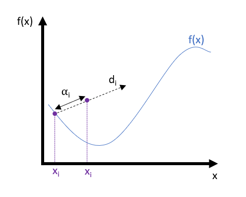
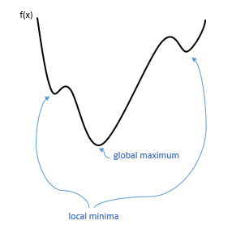
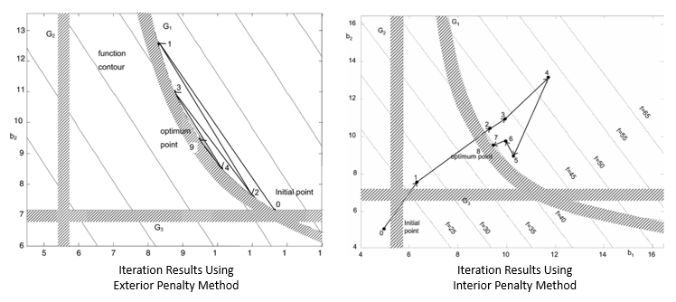

# Exterior Penalty Function Method

## Table of Contents
- [Overview](#Overview)
- [Background](#Background)
- [Penalty Function Method Overview](#Penalty-Function-Method-Overview)
- [Common Applications](#Common-Applications)
- [Formulation](#Formulation)
- [Penalty Function Options](#Penalty-Function-Options)
- [References](#References)

## Overview
The exterior penalty function method belongs to a group of algorithms called "penalty function methods." This is a specific subset of constrained optimization algorithm that transforms constrained optimization problems into successive minimization problems [1]. Given a cost function and equality/inequality constraints, the Exterior Penalty function iteratively searches for the local minimum of the cost function that satisfies the provided constraints. "Exterior" refers to the infeasibility of solutions generated during iteration, which the penalty aims to counteract [2].

## Background
In discussing optimization algorithms, it is important to first define the standard form of an optimization statement [3]:

$$
\begin{align}
minimize \ : \ f(x) \\
subject \ to: \ g(x) = 0 , \ h(x) \leq 0 \\
\end{align}
$$

where f(x) is called the *cost function*, and g(x) and h(x) are the two types of *constraints*. Most real-world problems include such constraints, making constrained optimization an invaluable type of optimization algorithm. These constraints describe any restrictions placed on the solution space, whether it be for physical, functional, or practical reasons. The cost function, or objective function, represents the design characteristic we wish to minimize. We can also achieve maximization of f(x) by minimizing -f(x).


Iterative optimization algorithms are a type of numerical method whose objective is to converge on the minimum or root of a function by minimizing the error between the estimated and true minimum at each iterative step. While these algorithms can be used on a variety of functions, they are most useful when no closed-form solution exists to the problem at hand. This technique dates back as far as the 15th century, beginning with the Islamic mathematician Jamshid al-Kashi. Using an iterative strategy, he computed $sin(1\degree)$ to nine decimal places, an accomplishment that mathematicians in Europe weren't aware of until the nineteenth and twentieth centuries [4]. Independently, Gauss also developed a scheme for "indirect elimination" that is sometimes credited with the first use of an iterative solution method. This method was built upon by other mathematicians of the time to create a foundation for the methods we use today [5].

These different iterative methods can be generalized to a common strategy that depends on *step length*, $\alpha$, and *rate of learning*, *d*. The rate of learning specifies the direction in which to iterate the design variables, while the step length indicates by how much to change the values of the design variables. Different algorithms have different strategies for selecting the values for step length and learning rate, which affects their speed of computation and ability to converge on a minimum value.



**General Iterative Method** [1]
1. Start with an initial trial point, **$x_{i}$**
2. Find a direction, **$d_i$**, that points towards the minimum
3. Find an appropriate step length, **$\alpha$** for movement along the direction, **$d$**
4. Update the current design point: **$x_{i+1} = x_{i} + \alpha_i * d_i$**
5. Repeat until acceptable value is found

It's important to note that these iterative algorithms are not generally finding the global minimum of a function:



Because most of these algorithms rely on local information about the cost function, the found minimum must be assumed to be a local minimum. In many cases (including Exterior Penalty Function Method), the initial estimate for x informs whether the minimum reached will be a global or local one. Even after finding a minimum with one of these optimization methods, it is difficult to determine whether it is the global optimum [3].


## Penalty Function Method Overview
Penalty functions methods are one branch of the previously mentioned “indirect” solution approaches. The defining trait of this class of function is that it transforms a constrained optimization problem into a sequence of **unconstrained** optimization problems (hence the need for iteration). This is accomplished by augmenting the constraints and cost function with a selected **penalty function** to form a pseudo-objective function that changes with each iteration of the solver [1]. Specifics on how this pseudo-objective function is developed are included in the [Formulation](#Formulation) Section.

The role of the penalty function in solving the optimization problem is dependent on whether the method is an *internal* or *external* penalty function. The critical difference between the two is the feasibility of solutions generated while iterating towards the final, optimal solution. Exterior methods generate a series of intermediate solutions that each violate the given constraints, while interior methods only generate intermediate solutions that are within the feasible region. A comparison of these two method subtypes to solve the same optimization problem is shown below [2]:



In the exterior method, the penalty function serves as a forcing function that pushes the solution back towards the feasible region. This serves as a check on the optimization of the cost function so that the resulting solution doesn’t violate the given constraints. However the interior method operates in reverse, using the penalty to push towards the boundary between the feasible and infeasible region of solutions [1]. These methods each have their own benefits and drawbacks, and comparisons between the two center around the fundamental tradeoff of indirect solution methods: likelihood of convergence and speed of convergence. Both methods are appealing for their computational efficiency, but exterior penalty methods are frequently seen as more desirable because of the robustness of their solution; they are more likely to converge on an optimal result. However in addition to being faster, interior methods also have the benefit of only returning solutions that meet the given constraints. Depending on the problem, this may be a necessary feature of the solution method [2].

## Common Applications
The exterior penalty function method has various applications that take advantage of its robust and convenient computation of optimization under constraints. One of the primary limitations on use cases for the exterior method is that the intermediate iterations present infeasible solutions. This can make the method unsuitable for applications such as optimal control, where intermediate results are incorporated into the system’s behavior, and violation of constraints would negatively impact the response [2]. The following are *some* of the most pertinent applications of the exterior penalty method.

One of the most frequently-used and easily understood uses of the method is in solving a design problem under uncertainty. Many physical and non-physical systems ultimately seek to minimize some characteristic like weight, size, etc., and have additional constraints on the design variables that dictate the system specifications. For example, one might use an exterior penalty function to minimize weight of a structure, while using constraints to maintain acceptable deflection and stress [6]. Penalty functions are often used in combination with [genetic algorithms](https://towardsdatascience.com/introduction-to-genetic-algorithms-including-example-code-e396e98d8bf3) to tackle constrained optimization problems that would be otherwise unapproachable; while genetic algorithms are an effective iteration method, they are incapable of incorporating constraints when used on their own. Incorporating a penalty function can allow enforcement of constraints, opening the method to a wider range of problems [7,8]. Finally, the exterior penalty method can be applied to finite-element analysis problems such as computational fluid problems or mechanical simulations. In these cases, the governing equations can be reformulated under the penalty function framework, which tends to improve computational efficiency and robustness [9,10].


## Formulation
As discussed previously, the exterior penalty function follows the same general framework as other indirect optimization methods. However the exterior penalty function also includes the construction of the pseudo-objective function, $\phi$, in order to find the optimal step length. $\phi$ is formed using the cost function, $f(x)$, and the loss function, $P(h(x),g(x),r)$:

$$
\begin{align}
\phi(x,r) = f(x) + P(h(x),g(x),r) \\
\end{align}
$$

where P is the selected penalty function. As discussed in [Background](#Background), $g(x)$ and $h(x)$ are equality and inequality constraints, respectively. $r$ is a penalty parameter, usually increased each iteration in order to maintain good conditioning of the problems as iterations continue [3]. Without it, the relative weight of the penalty function, $P$, compared to the cost function, $f(x)$, would decrease as the method minimized infeasibility of the current solution. This would diminish the solver’s ability to pull the design variables towards a feasible solution, resulting in a solution that violates the provided constraints. To determine the starting value of r, some trial and error is often required to converge on a solution. A good initial guess is 1.1 to 2.0 times the starting $f(x)$ value.

**Exterior Penalty Function Algorithm** [1]
1. Start with an initial design point, **$x_0$**
2. Set the initial penalty parameter, **$p_0$**
3. Determine which constraints are violated given the current design variable values
4. Construct **$\phi(x,r)$** using the current design variables and penalty parameter
5. Find search direction as **$d_i = \nabla \phi(x,r)$**
6. Express the new design variables in terms of step length (still unknown) and search direction: $x_{i+1} = x_i + \alpha * d_i$
7. Substitute this expression into **$\phi(x,r)$** and find a step size to minimize phi using any unconstrained optimization method
8. Substitute the found step size into the expression for $x_i$ to find new design variable values
9. Update the penalty parameter as $r_{k+1} = C * r_i$ where C is a constant
10. Repeat until optimum is reached

The above iterative process ends when none of the constraints are violated. As a result, this method doesn’t necessarily find interior extremes, but rather just extremes that occur on the boundary between the feasible and infeasible regions. Whether the algorithm converges on a result (and how fast this convergence occurs) is dependent on the choice of penalty function. A comparison of choices for penalty functions and more detail on steps three and four are given in the following section, [Penalty Function Options](#Penalty-Function-Options).

This process is often put into practice in code, as several iterations are necessary to reach the feasible region:

```
$$
x_i = x_0
p_i = C*f(x_i)				{Where C is between 1.1 and 2.0)
while h(x_i) >= 0, g(x_i) \= 0		{While constraints are violated}
  P(h,g,r) =penalty function		{Construct chosen penalty function}
  phi = f + P
  d = gradient(phi) @ x_i
  x_new = x_i + alpha*d			{Write x_new symbolically}
  phi = phi(x_new)			{Plug symbolic representation into phi}
  alpha* = solve(diff(phi) = 0)		{Solve to minimize pseudo-objective function}
  x_new = x_new(alpha*)			{Update design variables}
  r_new = C*r_i				{Update penalty parameter}
end
$$
```


## Penalty Function Options

As the method’s name implies, the specific choice of penalty function is extremely important in determining the performance of an exterior penalty function method. There are a variety of possible formulations, which aim to find the optimal penalty to ensure the method converges on an optimal solution. The choice must strike a balance between too severe a penalty, in which case the method may be unable to find a true optimum along the feasible boundary, and one that isn’t severe enough, which may cause the search to get stuck in the infeasible region and never converge. The latter is a particular problem when a search region is too large, such that the method spends excessive time exploring the infeasible space. It is also important to consider the potential diminishing returns of honing a penalty function; changes to a penalty function may have minimal impact on the optimality of the final solution, so sometimes the best solution is one that minimizes the effort taken to evaluate the penalty function [11]. In addition to these factors, [12] provides the following list of factors that influence the right choice of solution method:
* Type of Objective Function
* Number of Design Variables
* Number of Constraints
* Types of Constraints
* Number of Active Constraints at the Optimum
* Ratio Between Size of Feasible and Infeasible Search Space

These considerations can be related more closely to a choice of penalty function by reviewing the types of penalty functions available. Generally, penalty functions all follow the same basic scheme: check whether constraints are violated, then apply penalties based on which constraints are satisfied. This way, when no constraints are violated the penalty function will be equal to zero. However the value of the penalty function when constraints *are* violated depends on the type of penalty function applied: 

### Static Penalty Function
The first and simplest type of penalty function is static penalty functions. These penalty functions apply a constant value if a constraint is violated, or alternatively apply a constraint based on how many constraints are violated. They can also attempt to incorporate some measure of distance from the feasible region, but this relies on the assumption that  nearness to feasibility is equivalent to the fitness of the solution. An example static penalty function is shown below for a problem with *m* constraints:

$$
\begin{align}
P = \sum_{i=1}^m C_i \delta_i \\
\delta_i = 1 \ if \ constraint \ i \ is \ violated \\
\delta_i = 0 \ if \ constraint \ i \ is \ satisfied \\
\end{align}
$$

While this method is simple and efficient to evaluate, the determination of the *C* coefficients can be challenging. This issue is improved upon with dynamic penalty functions [11].

### Dynamic Penalty Function
Unlike static functions, these incorporate a dynamic element that changes the penalty applied based on the infeasibility of the current solution. It also incorporates the previously mentioned penalty parameter, *p*. The primary benefit of this type of function is that it allows highly infeasible solutions at the start of the search process, but as time goes on, higher penalties are applied for solutions that fail to approach the feasible region [11].

One example of a dynamic penalty function is the popular Quadratic Penalty Function. The following shows the application of the Quadratic Function with *m* inequality constraints and *n* equality constraints [1,13]:

$$
\begin{align}
P = r \sum_{i=1}^m \delta_i^2 + r \sum_{j=1}^n g_j(x)^2 \\
\delta_i = h(x) \ if \ constraint \ i \ is \ violated \\
\delta_i = 0 \ if \ constraint \ i \ is \ satisfied \\
\end{align}
$$

If we restrict the problem to only inequality constraints, we can also describe the convergence of the Quadratic Penalty Method:

> *Theorem:* Let $x_k$ be a sequence generated by the quadratic exterior penalty method. Then, any limit point of the sequence is a solution to the inequality constrained minimization problem  [14].

Note that this indicates the final solution will satisfy the constraints as the number of iterations approaches infinity, not that it will necessarily be the optimum solution available on the edge of the feasible region. Commenting on the optimality of the limit point is more challenging, and requires additional assumptions about the chosen tolerances and penalty parameters for the given problem [13]. We can additionally note that conditioning of this problem is given by the Hessian of $\phi$. This provides the needed justification for the use of an increasingly large penalty parameter in order to avoid an ill-conditioned problem.

### Adaptive Penalty Function
This type of penalty function incorporates even more information about the iterative process, using knowledge of the ongoing success of the solver. The search for an optimal solution can be divided into intervals over $N_f$ generations. Whether or not the best solution was found in the previous interval informs the value of the next penalty function multiplier, $\lambda$, using constants, $\beta_1$ & $\beta_2$, guiding the search towards attractive regions or away from areas that have already been searched for an optimum [11].

$$
\begin{align}
P = \sum_{i=1}^m \lambda_k d_i^k \\
\lambda_{i+1} = \lambda_k \beta_1 \ if \ previous \ interval \ has \ infeasible \ best \ solution\\
\lambda_{i+1} = \lambda_k / \beta_2 \ if \ previous \ interval \ has \ feasible \ best \ solution\\
\lambda_{i+1} = \lambda_k \ otherwise\\
\end{align}
$$


## References

1. Choi, S.-K., Grandhi, R. V., &amp; Canfield, R. A. (2007). Chapter 5: Reliability-based Structural Optimization. In Reliability-based Structural Design (pp. 153–202), Springer-Verlag London.
2. Malisani, P., Chaplais, F., &amp; Petit, N. (2014). An interior penalty method for optimal control problems with state and input constraints of Nonlinear Systems. Optimal Control Applications and Methods, 37(1), 3–33. https://doi.org/10.1002/oca.2134 
3. Heath, M. T. (2009). Chapter 6: Optimization. In Scientific computing: An introductory survey (pp. 256–308), McGraw Hill.
4. Knight, J. (2018). Al-Kash. In Encyclopedia.com. Infonautics Corp.
5. Saad, Y. (2020). Iterative methods for linear systems of equations: A brief historical journey. 75 Years of Mathematics of Computation, 197–215. https://doi.org/10.1090/conm/754/15141 
6. Ebenau, C., Rottschäfer, J., &amp; Thierauf, G. (2005). An advanced evolutionary strategy with an adaptive penalty function for mixed-discrete structural optimisation. Advances in Engineering Software, 36(1), 29–38. https://doi.org/10.1016/j.advengsoft.2003.10.008 
7. Yeniay, Ö. (2005). Penalty function methods for constrained optimization with genetic algorithms. Mathematical and Computational Applications, 10(1), 45–56. https://doi.org/10.3390/mca10010045 
8. Grasmeyer, J., &amp; Grasmeyer, J. (1997). Application of a genetic algorithm with adaptive penalty functions to airfoil design. 35th Aerospace Sciences Meeting and Exhibit. https://doi.org/10.2514/6.1997-7
9. Reddy, J. N. (1982). On penalty function methods in the finite-element analysis of flow problems. International Journal for Numerical Methods in Fluids, 2(2), 151–171. https://doi.org/10.1002/fld.1650020204 
10. Kim, S. J., &amp; Kim, J. H. (1993). Finite element analysis of laminated composites with contact constraint by extended interior penalty methods. International Journal for Numerical Methods in Engineering, 36(20), 3421–3439. https://doi.org/10.1002/nme.1620362003 
11. Bäeck Thomas, Fogel, D., Michalewicz, Z., Coit, D. W., &amp; Smith, A. E. (1995). Section C 5.2: Penalty Functions. In Handbook of Evolutionary Computation, Oxford University Press and Institute of Physics Publishing.
12. Michalewicz, Z. (1995). Genetic Algorithms, Numerical Optimization, and Constraints. Retrieved December 7, 2022, from https://cs.adelaide.edu.au/~zbyszek/Papers/p16.pdf.
13. Nocedal, J., &amp; Wright, S. J. (2006). Chapter 17: Penalty and Augmented Lagrangian Methods. In Numerical optimization (pp. 497–528), Springer.
14. Luenberger, D., &amp; Ye, Y. (2008). Chapter 13: Penalty and Barrier Methods. In Linear and nonlinear programming (4th ed., Ser. Operations Research and Management Science, pp. 409–440), Springer. 
