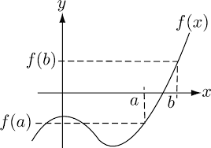
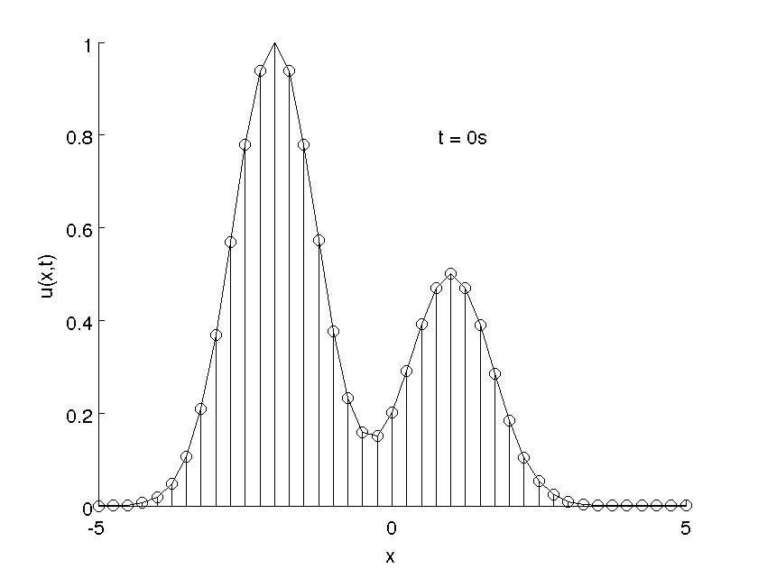

# CX/MATH 4640 Final Project

The CX/MATH 4640 final project is a Wiki/Scholar-pedia-style article on a topic either assigned to you or chosen by you (discussed below).
The goal is for you to describe a particular topic to a younger you understandably.
For your topic, you should cover topics discussed in class and methods/algorithms/strategies that go beyond what was discussed in class.
Take some time to learn about new methods, how they could go wrong, and when they go right, and write about them, just like a Wikipedia article would.


## What your article should contain

__In your own words.__

* An appropriate explanation of the key points of the topic (see "Audience" below)

* Description of methods used to solve the problem
	* Algorithms you learned! And likely some we didn't have time to go over.

* When the methods fail and when they do well
	* For example, conditioning can play a role here.

* Edge cases or special cases of the problem. 
	* For example, solving banded matrices is a "special case" of solving a linear system.

* Compact pseudocode for key algorithms in the topic you chose (if appropriate)

* Appropriate paper and book references at the bottom of the document. Use a consistent style (e.g., APA).

* I encourage you to write an article that is a hybrid between a Wikipedia article (a bit more general audience) and a [Scholarpedia](http://www.scholarpedia.org/article/Main_Page) article (a bit more technical). 
For example, try:
	* Including some history and example applications in your article (Wikipedia-style) 
	* Including some pseudocode and some degree of nuance via equations (Scholarpedia-style)
	* Here are some such examples 
		* http://www.scholarpedia.org/article/Galerkin_methods
		* http://www.scholarpedia.org/article/Meshless_methods_for_PDEs
		* https://en.wikipedia.org/wiki/Euler_method

## What your article should not contain

* Videos (But `.gif` is acceptable! Though __do not__ upload anything more than 25MB large. Github will reject it.)
* Grammar or spelling errors
* Plagiarism. I will check your documents (it's easy to do this since they will all be plain text). If you plagiarize, it will be obvious. 

## Some things you are allowed to do but might not be obvious

* You _are_ allowed to use external links! You are also encouraged to cite other books and papers (see below).
* You _are_ allowed to use HTML within your Markdown document so long as it renders appropriately within Github. 
You should check that it renders appropriately by creating a private GitHub repository for your article and ensuring it works as expected! 

## How to submit

Submit your document to Canvas formatted as a `.zip` (if you included images) or `.md` (if not).

__Be sure to create a (private) repository on your Github profile to ensure your article shows up as you intended!__

Include the following header at the top of your `.md` file:
```
---
Name: Your Name
Topic: [Topic Number from topics.md]
Title: Title of your article
----
```

## Formatting 

Use "GitHub" flavored markdown, a slightly different version of the "vanilla" markdown. The file extension is usually `.md`.
You can include equations in the usual LaTeX-like way, $Ax=b$, or like this
$$Ax=b.$$
You can view the source of this markdown document by clicking the edit/raw button on its source; it's also at [this link](https://raw.githubusercontent.com/numerical-analysis-f23/project-help/main/readme.md).



You can also include images like this (notice that the image file is in the repository)! 



You can also include `.gif`s!

Pseudocode is included via triple backticks, like this
```
Pseudocode
Can
Go 
Here
```
and inline code can `go like this`.

Here are some links for Github-flavored markdown syntax that could be helpful:
* https://github.com/adam-p/markdown-here/wiki/Markdown-Cheatsheet
* https://docs.github.com/en/get-started/writing-on-github/getting-started-with-writing-and-formatting-on-github/basic-writing-and-formatting-syntax

## Length

The length of your article is flexible. 
However, I understand it is useful to put some bounds on things.

Here are some example articles that are probably too short
* http://www.scholarpedia.org/article/Fixed_point
* http://www.scholarpedia.org/article/Normal_forms
* https://en.wikipedia.org/wiki/Numerical_method

Here is one that [is probably too long](https://en.wikipedia.org/wiki/Floating-point_arithmetic) for this project, though I will certainly not mark you down if you write something this comprehensive!

## Audience

Write your article in a way that would be understood by a student who is about to take this course but hasn't started yet (you just a few months ago!).
For example, [here is one](http://www.scholarpedia.org/article/WENO_methods) that is presented in a way that is likely too complex for your mock audience. 

## How you will be graded

From the `topics.md` document: 
> Some of these topics may be easier or harder to write about depending on at what length they were discussed in class. Some of these topics were not discussed in class, but are very closely related to what was discussed in class. This will be taken into account while grading, with somewhat fewer details and less depth or "strictness" expected for more complex or less-discussed topics. In this vein, a uniformly knowledgeable person would find all of these topics equally challenging (or easy!). In practice, I recommend prioritizing topics that seem interesting to you (or suggest your own, if you like!).

### Rubric

* 60% __Technical correctness and completeness.__ Get full points here by
	* Not saying technically incorrect things. 
	* Completeness is a bit nebulous here. You do not need to include _everything_ you could discuss about your topic (that could be an entire textbook in some cases!). 
	Instead, include a combination of breadth and depth that aligns with some of the Wikipedia/Scholarpedia examples provided. 
	* In many cases you should include some equations, pseudocode, and examples to explain your topic, though there are a few exceptions. Use your discretion.
	* Not mentioning a method critical to your topic could result in deducted points, especially if that topic was discussed at length in class.

* 20% __Clarity.__ Get full points here by
	* Not including topics that are irrelevant to yours (at least not without an explanation of why they are there!). 
	* Do include references to topics, via links and proper references, that are relevant to yours. 
	* Use hyperlinks to navigate around your document (for example, [like this](https://stackoverflow.com/questions/2822089/how-to-link-to-part-of-the-same-document-in-markdown)). 
	* Make your document intellectually accessible to your mock audience (discussed above). 
	* No nonsequiturs.
	* Use proper English grammar. 
	* No spelling mistakes.

* 10% __Presentation.__ Get full points here by
	* Using high-quality graphics (if you use graphics). 
	* Consistent style.
  	* Consistent referencing style (e.g., APA formatting).
	* Proper use of tables, figures, lists (bulleted and enumerated), etc.
	* _Make it something you would be proud to show to your colleagues!_

* 10% __Organization.__ Get full points here by 
	* Separate and organize sections and subsections appropriately. 
	* Include a table of contents
	* References and URL references in an appropriate location.

## References

1. References
2. Can
3. Go
4. Here
5. Like
6. This
7. Bryngelson, S. H., & Freund, J. B. (2018). Global stability of flowing red blood cell trains. Physical Review Fluids, 3(7). https://doi.org/10.1103/physrevfluids.3.073101 
